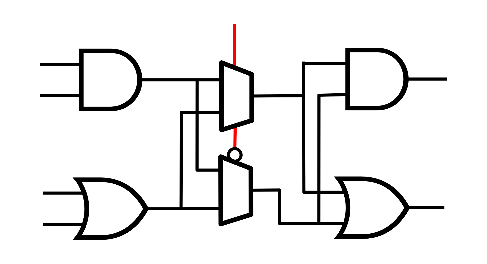

# Logic Locking for Yosys


## Description

When creating an electronic circuit, manufacturing steps are usually performed by third-party actors. In order to build confidence that the circuit built is not tempered with and is not used by third-parties, a variety of methods have been devised. A common approach, *logic locking*, is to introduce additional logic that requires the correct key to function as designed.

This mangling makes it more difficult to reverse-engineer the circuit, to add trojans, or simply to reuse without the correct key.

This repository provides a Yosys plugin to add logic locking functionality to a circuit.

[Slides](https://wiki.f-si.org/images/5/5c/Gabriel_Gouvine_MOOSIC_FSiC_2023.pdf) and [Video](https://peertube.f-si.org/videos/watch/7f250190-6d8f-4a67-8ed6-d07deda7fba0) from [Free Silicon Conference 2023](https://wiki.f-si.org/index.php/FSiC2023)


## Techniques used


A technique used here is the insertion of XOR/NXOR gates on wires carrying signals, such that an extra input with the correct value is required for them to act as a (buffered) wire again. This value is 1 for NXOR and 0 for XOR.
The key needs to be supplied as an input to unlock the circuit.



Another technique is the mixing of signals using multiplexers. A MUX is inserted on a wire with an irrelevant signal connected to the other input of the MUX. The key value selects between the correct signal and the irrelevant one.

Key handling (getting the key onto the chip) is left to the user.

## Using the plugin

The plugin defines a new `logic_locking` command. To run Yosys with the plugin:

```sh
yosys -m moosic-yosys-plugin
```

And in Yosys, with a synthetized design:
```
# Look at the command documentation
help logic_locking

# Add logic locking with a 16b key, with hexadecimal key 048c
logic_locking -key-bits 16 -key 048c

# Run design space exploration and export the result to test_dir; the design is not modified
logic_locking -explore -output-dir test_dir

# Add logic locking up to 5% of the module size, maximizing output corruption, with an auto-generated key
logic_locking -key-percent 5 -target corruption
```

A new port is created on the selected module, named `lock_key`. The module will work as designed only when the correct key is provided as an input.

## Installation instructions

To install this plugin
-   Install [Yosys](https://github.com/YosysHQ/yosys) from source or from [oss-cad-suite](https://github.com/YosysHQ/oss-cad-suite-build) (a recent version is required).
-   Build and install:
```sh
make
sudo make install
```


## Questions

You can ask any question you have on the [Matrix channel](https://app.element.io/#/room/#moosic-yosys-plugin:matrix.org). Don't hesitate to file an issue if you find a bug.
