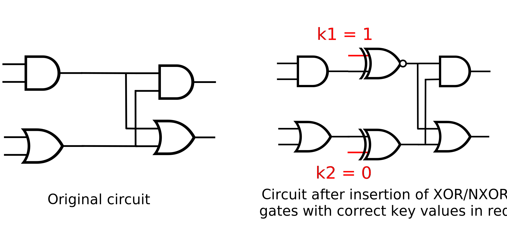

[](https://doi.org/10.5281/zenodo.10391922)

[](https://app.codacy.com/gh/Coloquinte/moosic-yosys-plugin/dashboard?utm_source=gh&utm_medium=referral&utm_content=&utm_campaign=Badge_grade)
[](https://opensource.org/licenses/gpl-2.0)

# Logic Locking for Yosys


## Description

When creating an electronic circuit, manufacturing steps are usually performed by third-party actors. In order to build confidence that the circuit built is not tempered with and is not used by third-parties, a variety of methods have been devised. A common approach, *logic locking*, is to introduce additional logic that requires the correct key to function as designed.

This mangling makes it more difficult to reverse-engineer the circuit, to add trojans, or simply to reuse without the correct key.

This repository provides a Yosys plugin to add logic locking functionality to a circuit.

[Slides](https://wiki.f-si.org/images/5/5c/Gabriel_Gouvine_MOOSIC_FSiC_2023.pdf) and [Video](https://peertube.f-si.org/videos/watch/7f250190-6d8f-4a67-8ed6-d07deda7fba0) from [Free Silicon Conference 2023](https://wiki.f-si.org/index.php/FSiC2023)


## Logic locking in a nutshell



The most common technique for logic locking is to insert XOR/NXOR gates on some wires of the design, such that an extra input with the correct value is required for them to act as a (buffered) wire again.
This value is 1 for NXOR and 0 for XOR.
The key needs to be supplied as an input to unlock the circuit.
This is the method used by the plugin.


Any gate that keeps the previous functionality can be inserted.
For example, we can mix signals using multiplexers. A MUX is inserted on a wire with an irrelevant signal connected to the other input of the MUX. In this case, the key value selects between the correct signal and the irrelevant one.
Another possibility is to replace gates with lookup-tables, which will have to be programmed correctly.

Key handling (getting the key onto the chip) is left to the user.

## Using the plugin

The plugin defines a new `logic_locking` command. To run Yosys with the plugin:

```sh
yosys -m moosic
```

And in Yosys, with a synthetized design:
```sh
# Look at the command documentation
help logic_locking

# Add logic locking with a 16b key, with hexadecimal key 048c
logic_locking -key-bits 16 -key 048c

# Add logic locking up to 5% of the module size, maximizing output corruption, with an auto-generated key
logic_locking -key-percent 5 -target corruption
```

A new port is created on the selected module, named `moosic_key` by default.
The module will work as designed only when the correct key is provided as an input.

## Installation instructions

To install this plugin
-   Install [Yosys](https://github.com/YosysHQ/yosys) from source or from [oss-cad-suite](https://github.com/YosysHQ/oss-cad-suite-build) (a recent version is required).
-   Build and install:
```sh
make
sudo make install
```


## Design space exploration

Moosic allows you to explore the tradeoffs between performance and security.
This will suggest many possible solutions with different tradeoffs (a Pareto front).
It is up to you to pick one that works best for your usecase.

```sh
# Run design space exploration on area, delay and corruption
# Export solution identifiers and results to explore.csv
ll_explore -area -delay -corruption -output explore.csv

# Show the gates that will be locked by a solution
ll_show -locking 38b0e

# Compute more information (area, delay, security, ...) on a solution
ll_analyze -locking 38b0e

# Apply a locking solution returned by design space exploration
# Modify the design, adding a key input port and key gates
ll_apply -locking 38b0e -key 048
```


## Questions

You can ask any question you have on the [Matrix channel](https://app.element.io/#/room/#moosic-yosys-plugin:matrix.org). Don't hesitate to file an issue if you find a bug.
